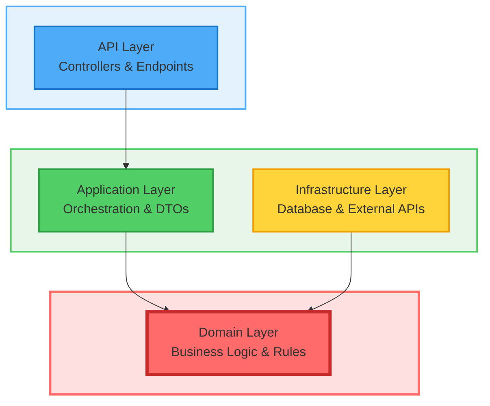
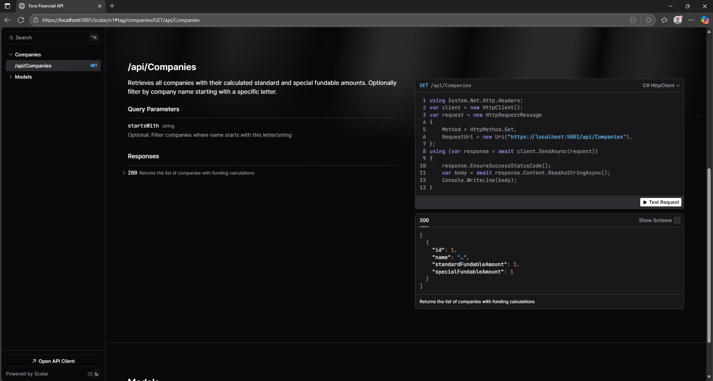
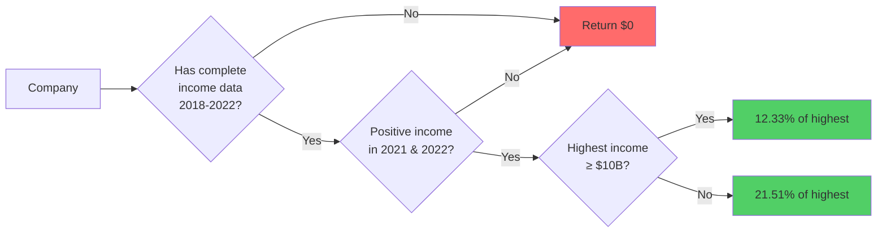
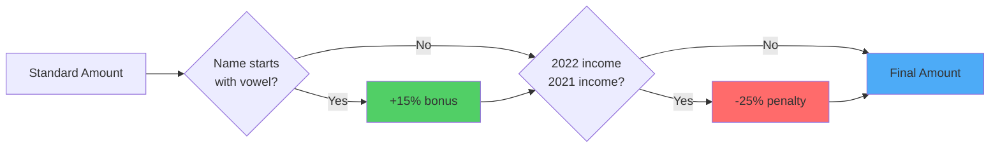
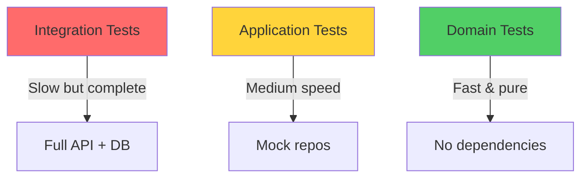

# Fora Financial Coding Challenge

[](https://github.com/cleberMargarida/fora-financial/actions/workflows/dotnet.yml)

> **A real-world .NET 8 Web API built with Domain-Driven Design and Clean Architecture**

---

## What I Built

Look, I could have thrown together a quick API that "just works." Instead, I built something you'd actually want to maintain six months from now. This is **production-grade code** with proper architecture, testing, and the kind of resilience patterns you need when things inevitably go wrong.

### What You Get

- **SEC EDGAR Integration** - Pulls data for 100 companies in the background 
- **Smart Funding Calculations** - All business logic lives where it belongs (hint: not in services)  
- **RESTful API** - Clean endpoints with Scalar docs (way better than Swagger UI)  
- **Layered Architecture** - DDD that actually makes sense  
- **Built-in Resilience** - Polly handles retries, circuit breakers, timeouts  

---

## The Architecture Story

### Why Not Just Services and Controllers?

Here's the thing: I've seen codebases where all the business logic lives in service classes. Six months later, you've got a 500-line method with nested if-statements that nobody wants to touch. **Domain-Driven Design** keeps your sanity intact.

**What I did instead:**
- Put business rules in **domain entities** where they belong
- Made it **impossible to create invalid states** (no more null checks everywhere)
- Kept layers separate so you can swap out databases without touching business logic
- Made testing actually pleasant (no mocking frameworks needed for domain tests)

### The Layers (Simplified)



**What each layer does:**
- **API** - HTTP stuff (controllers, validation, JSON)
- **Application** - Coordinates workflows (gets data, calls domain, saves results)
- **Domain** - All business logic (funding calculations, rules, invariants)
- **Infrastructure** - External stuff (database, SEC API, file system)

### Design Decisions That Matter

#### 1. Rich Domain Model (Not Data Bags)

I didn't build anemic entities that are just property bags. Each entity knows how to validate itself and enforce business rules.

```csharp
// ❌ What I avoided (anemic model)
public class Company { 
    public string Name { get; set; }  
    public List<Income> Incomes { get; set; }
}
// Business logic scattered across service classes

// ✅ What I built (rich model)
public class Company {
    public string Name { get; private set; }
    private readonly List<Income> _incomes = new();
    
    public FundingCalculation CalculateFunding() {
        var standard = CalculateStandardFundableAmount();
        var special = CalculateSpecialFundableAmount(standard);
        return new FundingCalculation(standard, special);
    }
}
// Business logic lives in the entity
```

**Why this rocks:**
- Business rules are **right there** in the code, self-documenting
- Can't accidentally create invalid state (private setters FTW)
- Unit tests don't need mocks or databases
- One place to change business logic

#### 2. Value Objects (Type Safety That Saves Lives)

No more passing around `decimal` everywhere and wondering "wait, is this USD or EUR?"

```csharp
// ❌ Primitive obsession
decimal amount = 12345.67M;  // What currency?

// ✅ Value objects
var money = Money.FromUSD(12345.67M);  // Crystal clear
```

#### 3. Repository Pattern (But Not Crazy About It)

Yeah, yeah, repositories are controversial. But here's why I used them: the domain layer doesn't know about Entity Framework. If I want to swap SQLite for PostgreSQL tomorrow, I change one class. Domain code? Untouched.

```csharp
// Domain defines the contract
public interface ICompanyRepository {
    Task<Company?> GetByCikAsync(int cik);
    Task<List<Company>> GetAllAsync();
}

// Infrastructure implements it
public class CompanyRepository(CompaniesContext context) : ICompanyRepository {
    // EF Core details hidden from domain
}
```

#### 4. Polly for Resilience (Because APIs Fail)

External APIs **will** fail. The SEC EDGAR API might timeout, return 500s, or just have a bad day. Polly handles this gracefully:

```csharp
builder.Services.AddHttpClient<IEdgarApiService, EdgarApiService>()
    .AddStandardResilienceHandler(options => {
        options.Retry.MaxRetryAttempts = 3;
        options.Retry.BackoffType = Polly.DelayBackoffType.Exponential;
        options.CircuitBreaker.FailureRatio = 0.5;
        options.CircuitBreaker.BreakDuration = TimeSpan.FromSeconds(30);
    });
```

**What this does:**
- Retries failed requests (with exponential backoff)
- Stops hammering a failing service (circuit breaker)
- Times out hung requests (no waiting forever)

#### 5. Background Jobs (No Blocking the API)

Importing 100 companies from an external API takes time. Users shouldn't wait. So the import runs in the background using `IHostedService`.

**Benefits:**
- API responds immediately
- Import runs on startup automatically
- Easy to move to Hangfire or Azure Functions later

---

## Running This Thing

### Prerequisites

- **.NET 8 SDK** ([grab it here](https://dotnet.microsoft.com/download))
- That's it. Seriously.

### Fire It Up

```powershell
# Clone and jump in
cd fora-financial

# Restore packages
dotnet restore

# Run it
dotnet run --project src/ForaFinancial.Api

# Hit the API docs
# Opens at https://localhost:5001/scalar/v1
```

**First run:** The app creates the SQLite database and imports 100 companies from SEC EDGAR in the background. Grab a coffee (takes 1-2 minutes).

---

## Using the API

### Interactive Docs

Fire up the app and hit `https://localhost:5001/scalar/v1` - you get a slick interface to test everything.



### The Endpoint

**GET** `/api/companies` - Get companies with funding calculations

**Query params:**
- `startsWith` (optional) - Filter by company name prefix

**Examples:**
```http
GET /api/companies
GET /api/companies?startsWith=A
GET /api/companies?startsWith=Uber
```

**Response:**
```json
[
  {
    "id": 1,
    "name": "UBER TECHNOLOGIES, INC.",
    "standardFundableAmount": 1234567890.12,
    "specialFundableAmount": 1419753073.64
  }
]
```

---

## The Business Logic

Here's where things get interesting. The funding calculation has specific rules, and they all live in the `Company` entity.

### Standard Funding Calculation



**The rules:**
1. Must have income for ALL years (2018-2022) - no gaps
2. Must have positive income in 2021 AND 2022
3. High earners (≥$10B): get 12.33% of their best year
4. Everyone else (<$10B): get 21.51% of their best year
5. Otherwise: $0

### Special Funding Calculation

Takes the standard amount and applies modifiers:



- **+15%** if company name starts with A, E, I, O, or U
- **-25%** if income declined from 2021 to 2022

---

## Testing

### The Testing Pyramid



### Automated CI/CD Pipeline

Every commit triggers a comprehensive test suite with automated coverage reporting:

#### Unit Test Coverage


| Package | Line Rate | Branch Rate | Complexity | Health |
|---------|-----------|-------------|------------|--------|
| ForaFinancial.Domain | 90% | 100% | 34 | ✔ |
| ForaFinancial.Application | 95% | 100% | 31 | ✔ |
| **Summary** | **92%** (215 / 234) | **100%** (52 / 52) | **65** | ✔ |

#### Integration Test Coverage


| Package | Line Rate | Branch Rate | Complexity | Health |
|---------|-----------|-------------|------------|--------|
| ForaFinancial.Domain | 68% | 58% | 114 | ➖ |
| ForaFinancial.Application | 92% | 87% | 50 | ✔ |
| ForaFinancial.Infrastructure | 72% | 100% | 16 | ➖ |
| ForaFinancial.Api | 100% | 100% | 4 | ✔ |
| **Summary** | **80%** (630 / 786) | **66%** (162 / 244) | **368** | ✔ |

**What this means:**
- **Domain layer** has excellent unit test coverage (90%) for business logic
- **Application layer** is thoroughly tested at 95% with full branch coverage
- **API layer** has 100% coverage - every endpoint is integration tested
- **Infrastructure layer** has solid coverage with complete branch testing

### Domain Tests (The Good Stuff)

These are **pure** - no database, no HTTP, no mocking framework. Just business logic.

```csharp
[Fact]
public void HighIncomeCompany_Gets_CorrectFunding()
{
    // Arrange
    var company = new Company(123, "Test Corp");
    company.AddIncome(Income.Create(2022, Money.FromUSD(12_000_000_000)));
    company.AddIncome(Income.Create(2021, Money.FromUSD(11_000_000_000)));
    // ... add 2018-2020
    
    // Act
    var funding = company.CalculateFunding();
    
    // Assert
    Assert.Equal(Money.FromUSD(12_000_000_000 * 0.1233m), 
                 funding.StandardFundableAmount);
}
```

**Why I love these:**
- Run in milliseconds
- No setup/teardown
- No flaky database issues
- Pure business logic validation

### Integration Tests

These test the whole stack - HTTP → Controllers → Services → Database:

```csharp
[Fact]
public async Task GetCompanies_ReturnsCorrectData()
{
    var client = _factory.CreateClient();
    var response = await client.GetAsync("/api/companies");
    var companies = await response.Content
        .ReadFromJsonAsync<List<CompanyFundingResponse>>();
    
    Assert.NotEmpty(companies);
    Assert.All(companies, c => Assert.True(c.StandardFundableAmount >= 0));
}
```

### Run Tests

```powershell
# All tests
dotnet test

# With coverage
dotnet test --collect:"XPlat Code Coverage"

# Specific test projects
dotnet test tests/ForaFinancial.Domain.UnitTests/
dotnet test tests/ForaFinancial.Application.UnitTests/
dotnet test tests/ForaFinancial.IntegrationTests/
```

**CI/CD Pipeline:** Tests run automatically on every push and pull request via GitHub Actions. Coverage reports are uploaded to Codecov and appear as PR comments.

---


### Design Philosophy

**"Make illegal states unrepresentable"** - Value objects and encapsulation mean you can't accidentally create invalid data.

**"Tell, don't ask"** - Entities make decisions and enforce rules. Services orchestrate, they don't contain business logic.

**"Be explicit"** - Clear layer boundaries, obvious dependencies, self-documenting code.

---

## Let's Talk About It

This solution is built to discuss. 

## About


**Built by:** Cleber Margarida  
**For:** Fora Financial Technical Assessment  

---
